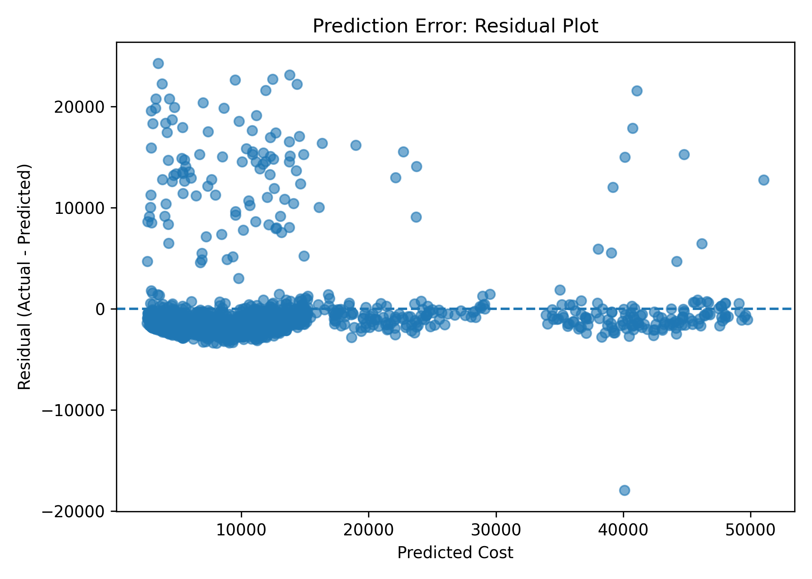
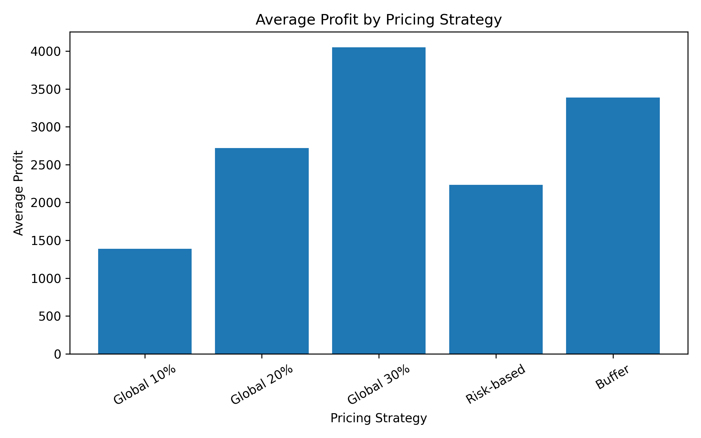
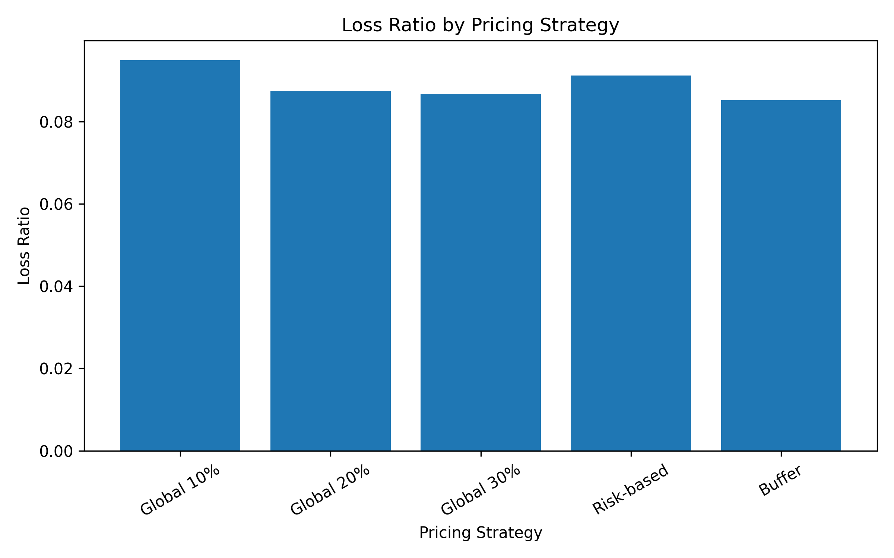
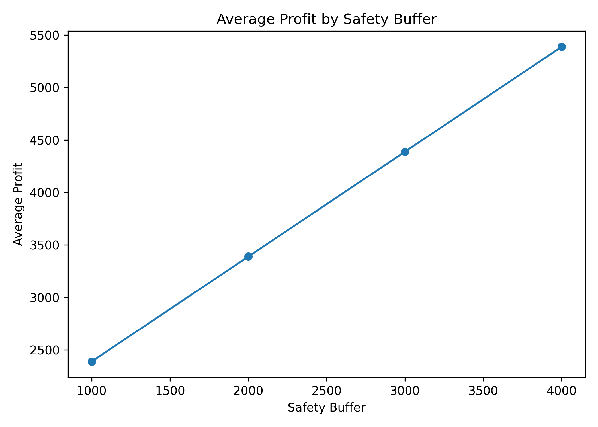
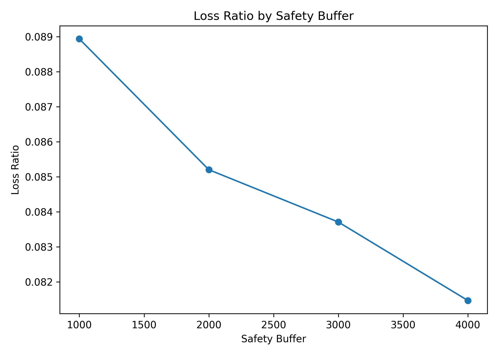

# Health Insurance Pricing Optimisation with Fairness Considerations

## Project Overview

This project develops a data-driven insurance pricing framework that combines machine learning-based cost prediction with pricing strategy design.  
The goal is to optimise profitability while explicitly analysing the trade-offs between financial performance and fairness.

---

## Problem Statement

Traditional insurance pricing relies on estimating expected medical costs and applying a margin. However, this raises several key challenges:

- How accurate are cost predictions?
- Can pricing adjustments reduce financial losses?
- Do pricing strategies introduce unfair cost distribution across individuals?

---

## Approach

The project is structured into three main stages:

### 1. Cost Prediction
- Built a regression model to estimate individual medical costs  
- Key features include age, BMI, and smoking status  
- Engineered interaction features to improve predictive performance  

---

### 2. Pricing Simulation

Tested multiple pricing strategies:

- **Global Margin**  
  Premium = predicted_cost × (1 + margin)

- **Risk-based Pricing**  
  Higher margins applied to high-risk groups  

- **Safety Buffer (Final Model)**  
  Premium = predicted_cost × (1 + margin) + buffer  

---

### 3. Evaluation

Measured:

- Profitability  
- Loss ratio  
- Pricing error (over/under-pricing)  
- Group-level fairness  

---

## Key Findings

### Prediction Error (Core Problem)

  

- Significant prediction errors exist, especially for high-cost individuals  
- Underestimation of these cases is the primary driver of financial losses  

---

### Pricing Strategy Comparison

  

  

- Increasing margins significantly improves profit  
- However, loss ratios remain relatively unchanged  
- This shows that **pricing alone cannot solve the loss problem**

---

### Safety Buffer Effect

  

  

- Adding a fixed buffer improves profitability  
- Loss ratios decrease gradually  
- Buffer acts as a safeguard against unpredictable high-cost cases  

---

## Final Pricing Rule

Final model:

    Premium = predicted_cost × (1 + 0.10) + 2000

- predicted_cost: estimated medical cost  
- 10% margin ensures baseline profitability  
- £2000 buffer accounts for uncertainty in predictions  

---

## Fairness Insights

- High-risk individuals (e.g., smokers) are charged more and generate higher profit  
- Low-risk individuals experience higher relative price increases due to the fixed buffer  
- Prediction errors disproportionately affect certain groups, leading to uneven loss distribution  

> The model is economically efficient but introduces fairness trade-offs through cross-subsidisation.

---

## Key Insight

> Pricing performance is driven more by prediction accuracy than pricing structure itself.

---

## Repository Structure
    data/   → dataset
    src/    → modelling and pricing scripts
    docs/   → detailed analysis (fairness, trade-offs, decisions)
    results/figures/ → generated visualisations

---

## Further Details

For deeper analysis:

- [Pricing Decision](docs/pricing_decision.md)  
- [Fairness Analysis](docs/fairness.md)  
- [Trade-offs](docs/tradeoff.md)  
- [Limitations](docs/limitations.md)  

---

## Future Work

- Improve prediction accuracy with richer features  
- Explore fairness-aware optimisation methods  
- Incorporate dynamic or personalised pricing strategies  

---